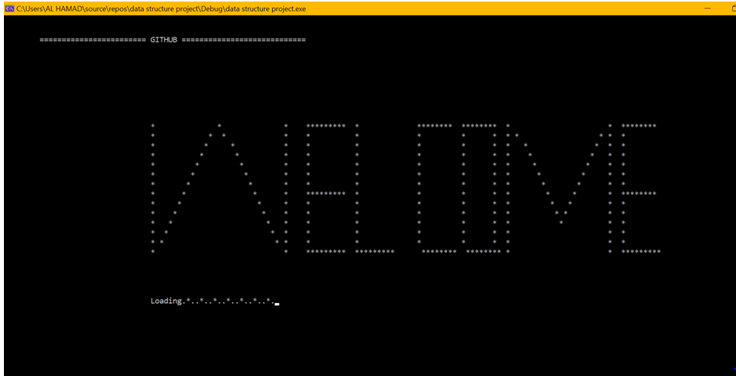
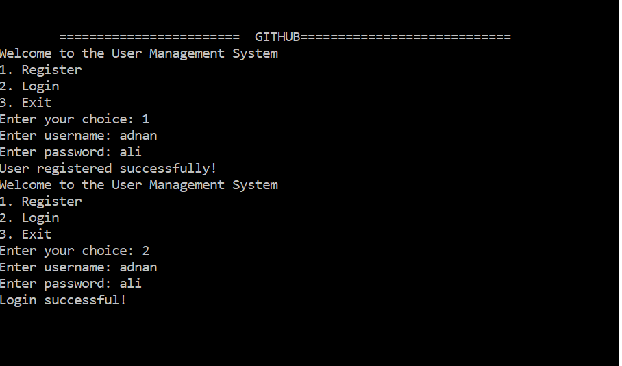

# GitHub Repository Simulator 📂🚀
A complete simulation of GitHub functionality implemented using **C++** and **Data Structures** (Linked Lists). This is a **Semester Project** for Data Structure Lab by Adnan Ali and Abdullah Zain.

---

## 📌 Features Implemented

✅ User Registration & Login  
✅ Repositories (Add / Delete / Fork / Set Visibility)  
✅ File Management with Commit History  
✅ Comments on Files  
✅ Follow / Unfollow Users  
✅ Persistent Data Storage using `.csv`  
✅ Truth Table Loading UI  
✅ Professional Console Interface

---

## 🛠️ Data Structures Used

- **Singly Linked Lists**:
  - For managing users
  - Repositories
  - Files and their commits
  - Comments on files

---

## 🏗️ File Structure

DSA-GitHub-Simulator/
│
├── src/
│ └── main.cpp
│
├── data/
│ ├── users.csv
│ └── <username>.csv (for repositories & files)
│
├── README.md
└── .gitignore

---

## 🚀 How To Run

### 1. Open the Project in Your C++ IDE (Code::Blocks, DevC++, VSCode)
### 2. Compile `src/main.cpp`
### 3. Run the Executable

---

## 🧠 How It Works

Each user can:
- **Create repositories**
- **Add files** to those repos
- **Commit** new versions
- **Fork** repositories from others
- **Comment** on files
- **Follow/unfollow** other users

All data is saved and loaded from `.csv` files for persistence.

---

## 👨‍💻 Authors

- Adnan Ali  

> Developed as part of the Data Structures Lab, Fall 2025

---

## 📸 UI Demo (Optional)

### 🔐 Login Screen

### 📂 Add Repository

---

## 📜 License

This project is for educational purposes. You can fork, learn, and use parts in your own assignments.

